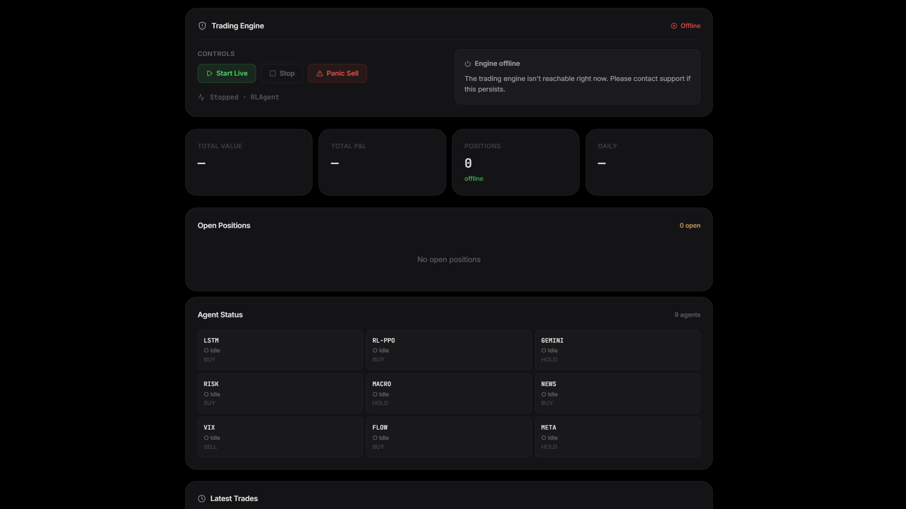

# 🤖 AAAgents — Autonomous Asset Management Agents
### Community Edition · Local-First · Apache 2.0

[](https://github.com/Autonomous-Asset-Management-Agents/aaagents-oss/actions/workflows/oss-ci.yml)
[](https://github.com/Autonomous-Asset-Management-Agents/aaagents-oss/releases)
[](https://opensource.org/licenses/Apache-2.0)
[](./docs/oss/ARCHITECTURE.md)
[](https://github.com/Autonomous-Asset-Management-Agents/aaagents-oss/discussions)

**The Open-Source, Regulation-Aware AI Trading Platform.**
No cloud subscription required. Runs on Docker. Paper-trading by default — no capital at risk until you explicitly configure live broker credentials.



> **Legal posture:** Research and educational software (Apache 2.0). No BaFin authorisation held. Operating for your own account requires no licence. See [DISCLAIMER.md](./DISCLAIMER.md) before deploying in any fiduciary or multi-user context.

> [!WARNING]
> **OSS Edition — Scope Limitations**
> This system is **NOT designed for High-Frequency Trading (HFT)** or professional day trading.
> Slight floating-point rounding errors in currency calculations are **architecturally accepted** in this edition due to the low signal frequency (minutes to hours, not milliseconds).
> For HFT, Decimal arithmetic, and fully regulated infrastructure, see the [Enterprise Edition](https://aaagents.de).
> 
> **Recommendation: Use Paper Trading only.** See `PAPER_TRADING=true` in your `.env.oss` file.

---

## ⚙️ Modes & Expectations

| Setup | Behavior |
|---|---|
| `.env.oss` only (no Alpaca keys) | **Offline Mode** — engine boots, all 9 agents vote, no orders execute. Useful for code exploration. |
| Alpaca paper-trading keys | **Paper Mode** (default) — orders route to Alpaca paper, real BUY/SELL signals. |
| Alpaca + `POLYGON_API_KEY` | Adds true CBOE VIX (without it, regime is derived from 60-day SPY volatility — same regime classes, slightly noisier signal). |
| Alpaca + `GEMINI_API_KEY` | **Full Sentiment Mode** — adds GeminiSentimentAgent and NewsContextAgent. Without it, the bot runs in **Degraded Sentiment Mode** (7/9 agents active). |

> **Without a model bundle release**, the engine still boots but the LSTM and RL agents vote neutral. See [TROUBLESHOOTING.md](./docs/oss/TROUBLESHOOTING.md#engine-running-but-no-trades-after-1-hour) if you don't see trades after market open.

---

## ⚡ Quick Start

**Prerequisites:** [Git](https://git-scm.com/), [Docker Desktop](https://www.docker.com/products/docker-desktop/) running with **at least 8GB RAM allocated** (🐋 whale icon visible in system tray), and a free [Alpaca Paper-Trading account](https://app.alpaca.markets).

```bash
# 1. Clone the repository
git clone https://github.com/Autonomous-Asset-Management-Agents/aaagents-oss.git
cd aaagents-oss

# 2. Start the stack 
make start
```

> **Note:** If you don't have `make` installed, you can run `bash setup.sh` (or `powershell -ExecutionPolicy Bypass -File setup.ps1` on Windows), then `docker compose --env-file .env.oss -f docker-compose.oss.yml up -d`.
>
> **Setup will prompt for your Alpaca paper-trading keys.** Paste them at the prompt and they are written straight into `.env.oss` (uncommented, ready to use) — the secret prompt hides your input on PowerShell, cmd.exe, and macOS/Linux terminals; on Git Bash for Windows the secret may be echoed (use PowerShell or pipe the value via stdin to avoid this). Press Enter at either prompt to skip and edit `.env.oss` later. For unattended / CI runs, pass `--non-interactive` to `python setup.py` (or pipe `< /dev/null` into `setup.sh` / `setup.ps1`) to skip the prompt.

🌐 **Dashboard:** Open **`http://localhost`** manually in your browser (Docker starts in the background and will not open it automatically). **First start:** allow 3–5 minutes (image pull + model download (skipped if no manifest in this release) + DB migration)

> **No build required.** Pre-built images are pulled automatically from GHCR:
> ```
> ghcr.io/autonomous-asset-management-agents/aaagents-backend:latest
> ghcr.io/autonomous-asset-management-agents/aaagents-public-api:latest
> ghcr.io/autonomous-asset-management-agents/aaagents-frontend:latest
> ```

> **Why Alpaca keys?** Without keys the system boots in **Offline Mode (Shadow Boot)** — all agents run, no orders execute. Add real Paper-Trading keys to `.env.oss` to activate order execution. See [setup details →](./docs/oss/README.md#step-2--configure-the-environment-one-command)

> [!IMPORTANT]
> **API Key Setup (OSS Edition):** Broker credentials are configured **exclusively via the `.env.oss` file**.
> The dashboard does **not** provide a UI to enter API keys. This is by design: the OSS edition uses `.env` as its
> single secret source, which is the industry standard for local open-source tools.
>
> ```env
> # In your .env.oss file:
> ALPACA_API_KEY=your_paper_trading_key_here
> ALPACA_SECRET_KEY=your_paper_trading_secret_here
> PAPER_TRADING=true
> ```
> The Enterprise Edition uses GCP Secret Manager instead. See the [OSS vs. Enterprise comparison below](#-oss-vs-enterprise).

---

## 🧠 What is AAAgents?

AAAgents maps the organisational structure of an institutional asset manager onto an autonomous software system. Each department becomes a strictly bounded software artefact:

| Layer | Component | Description |
|---|---|---|
| Research | **Round Table V2** | 9 specialised AI agents debate a symbol in parallel. A weighted `ConsensusEngine` aggregates votes (BUY > 0.65 / SELL < 0.35). |
| Risk & Compliance | **Iron Dome** | Every signal is audited before execution: PDT thresholds, VIX kill-switch, sector concentration limits, wash-trade detection. |
| Execution | **Broker API** | Deterministic, async order routing via Alpaca (paper-trading by default). |
| Reporting | **AAAgents Console** | React/TypeScript dashboard — live portfolio view, agent vote log, kill-switch panel. |

**Architecture invariant:** Round Table and Iron Dome are completely isolated. The Round Table has no access to account balances or open positions. The Iron Dome never overrides ML signals — it only enforces risk rules. This separation is enforced architecturally, not by convention.

---

## 🛠️ `make` Shortcuts

```bash
make setup   # Generate .env.oss with secure secrets (run once)
make start   # Setup (if needed) → docker compose up
make stop    # Stop all containers (data preserved)
make logs    # Tail backend logs
make reset   # Nuclear reset: remove containers + volumes
```

---

## 📚 Documentation

| Document | Description |
|---|---|
| [**Setup Guide**](./docs/oss/README.md) | Full step-by-step installation, port reference, troubleshooting |
| [Vision & Editions](./docs/oss/VISION_AND_EDITIONS.md) | AAAgents ecosystem, Community vs. Enterprise |
| [Architecture](./docs/oss/ARCHITECTURE.md) | Bounded contexts, plugin API, auth abstractions, engine bootstrap |
| [Troubleshooting](./docs/oss/TROUBLESHOOTING.md) | Startup failures, DB migrations, Iron Dome blocks, TLS proxy |
| [Plugin Tutorial](./docs/oss/PLUGIN_TUTORIAL.md) | Write and register your own strategy agent |
| [Contributing](./CONTRIBUTING.md) | PR workflow, coding standards, Archon Standard gate |
| [Security](./SECURITY.md) | Responsible disclosure policy |
| [Disclaimer](./DISCLAIMER.md) | Legal posture, BaFin positioning, liability |

For AI coding assistants: use `CLAUDE.md` (auto-loaded by Claude Code) as your entry point.

---

## 📊 OSS vs. Enterprise

This table defines the architectural scope of each edition. Treat it as the authoritative boundary.

| Feature | OSS (Community Edition) | Enterprise |
|---|---|---|
| **Deployment** | Local Docker | GCP Cloud Run |
| **Authentication** | `LocalMockAuth` (127.0.0.1-only) | Firebase Auth + OIDC |
| **Secret Management** | `.env` file | GCP Secret Manager |
| **Tenancy** | Single-tenant | Multi-tenant |
| **Currency Arithmetic** | `float` (acceptable for low-frequency) | `Decimal` / strict primitives |
| **Pre-Market Orders** | Supported (intentional for async queue logic) | Supported |
| **HFT / Sub-second trading** | ❌ Not supported | Roadmap |
| **Compliance Logging** | File-based (WORM-lite) | Cloud Logging + Audit Trail |
| **Model Weights** | Bundled (CC-BY-4.0) | GCS-synced, versioned |
| **Support** | GitHub Discussions | Enterprise SLA |

## 🔌 Plugin System — Add Your Own Strategy

The Round Table is fully extensible. A minimal plugin:

```python
# plugins/round_table/my_strategy.py
from core.round_table.base_agent import VotingAgent, VoteResult
from core.round_table.registry import register_agent

@register_agent("MyStrategyAgent")
class MyStrategyAgent(VotingAgent):
    default_weight: float = 15.0

    async def vote(self, state: "SymbolEvalState") -> VoteResult:
        # Return a score: 0.0 = Strong Sell | 1.0 = Strong Buy
        return VoteResult(
            agent_name=self.__class__.__name__,
            symbol=state["symbol"],
            score=0.6,
            weight=self.weight,
            reasoning="Example: neutral-bullish signal."
        )
```

Activate in `.env.oss`:
```env
ALLOW_UNTRUSTED_PLUGINS=true
ROUND_TABLE_PLUGINS_DIR=/app/app/plugins/round_table
```

> ⚠️ **`ALLOW_UNTRUSTED_PLUGINS=true` is effectively arbitrary code execution** as the container user. Every `.py` file in the plugin directory is imported at engine boot. Only enable if you wrote or fully reviewed each file yourself. Default is `false` (deny-by-default).

Full Plugin API: [docs/oss/PLUGIN_TUTORIAL.md](./docs/oss/PLUGIN_TUTORIAL.md)

---

## 🛠️ Development Setup (native, no Docker)

```bash
python -m venv .venv
source .venv/bin/activate          # Linux / macOS
# .\.venv\Scripts\activate         # Windows

# PyTorch CPU-only wheel first (avoids ~3 GB CUDA download)
pip install torch --index-url https://download.pytorch.org/whl/cpu
pip install -r requirements.txt

# Run unit tests
pytest tests/unit/ -v

# Code quality (mandatory before any PR)
black .
flake8 .
```

---

## 🤝 Community

- 💬 [GitHub Discussions](https://github.com/Autonomous-Asset-Management-Agents/aaagents-oss/discussions) — questions, ideas, plugin showcase
- 🐛 [Issues](https://github.com/Autonomous-Asset-Management-Agents/aaagents-oss/issues) — bug reports
- 📖 [Contributing Guide](./CONTRIBUTING.md) — how to submit PRs

---

## 📄 License

- **Source Code:** Apache 2.0 — see [LICENSE](./LICENSE)
- **Model Weights (PyTorch):** CC-BY-4.0 — see [LICENSE-MODELS](./LICENSE-MODELS)

---

*Maintained by the AAAgents Community · [aaagents.de](https://aaagents.de) · [Releases](https://github.com/Autonomous-Asset-Management-Agents/aaagents-oss/releases)*
